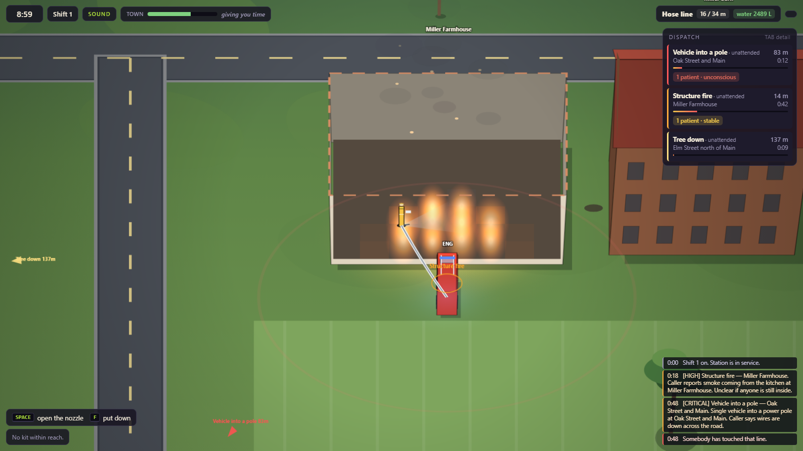
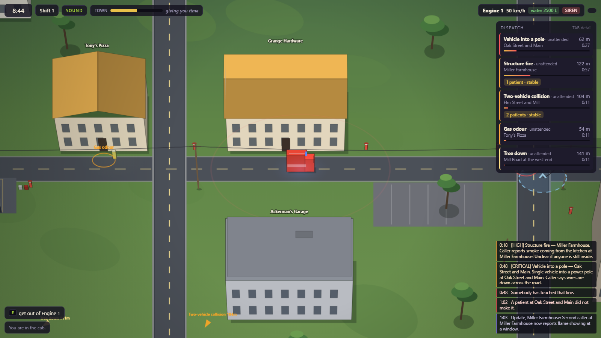
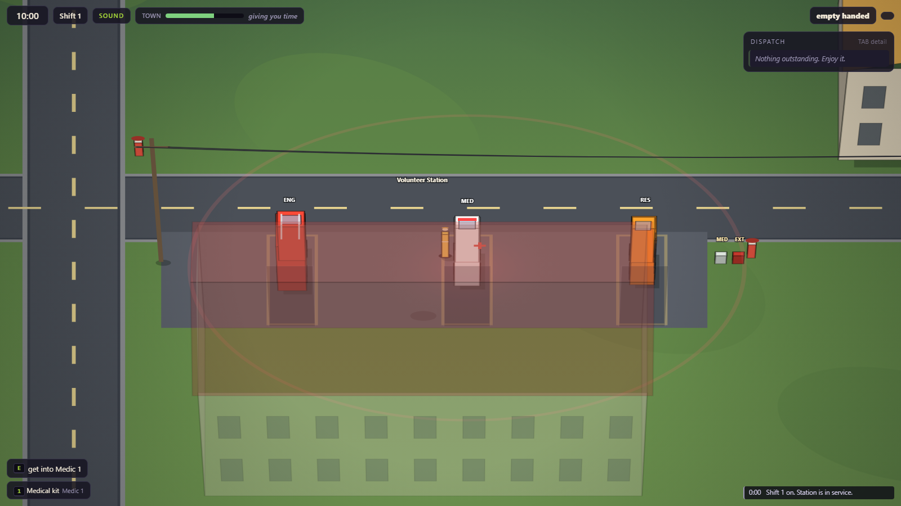
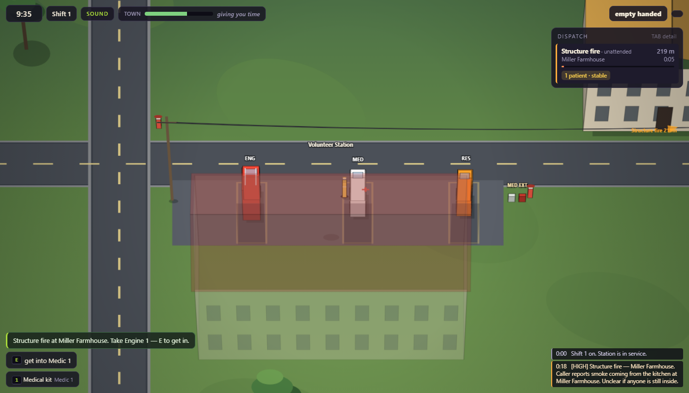
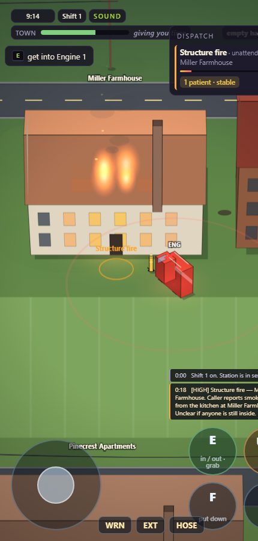
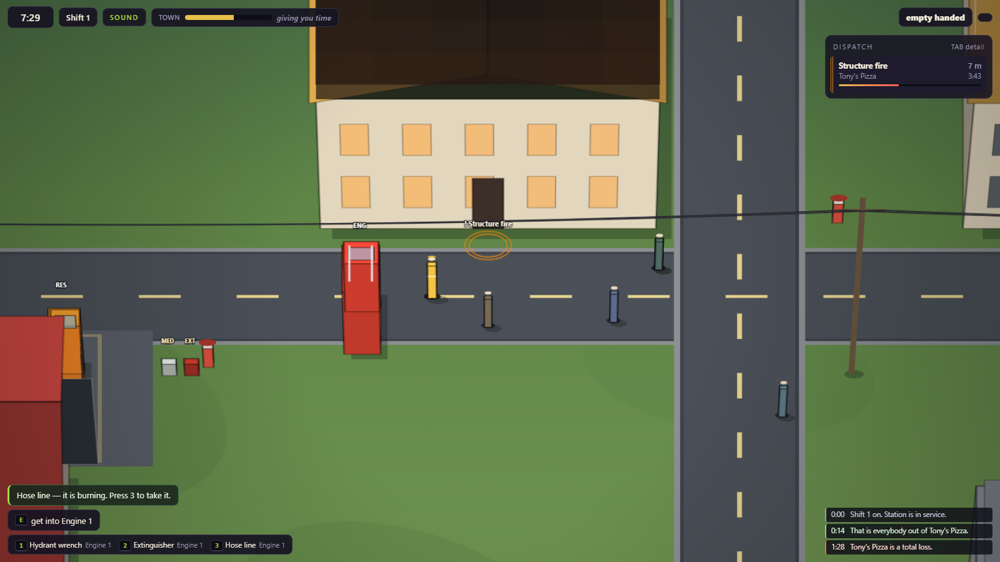

# Small Town Emergency Services

A cooperative emergency-response sandbox in one continuous three-quarter-view town, for
two players on one keyboard or two browsers on opposite ends of the internet. Browser, Canvas 2D, ES modules, zero dependencies,
no build step.

**▶ Play it: https://dumb-tony.github.io/SmallTownEmergencyServices/**

> **The town keeps going without you.**

Calls arrive incomplete and keep arriving. They age, deteriorate, combine and reroute
traffic whether or not anybody has driven to them. Nothing pauses when you open a panel,
nothing waits at the edge of a trigger volume, and losing a call does not end the shift —
it changes the town you turn up to next time.

See [GDD.md](GDD.md) for the design this is built against, and
[CHANGELOG.md](CHANGELOG.md) for what has actually been built.








## Running it

Play the published build at
**https://dumb-tony.github.io/SmallTownEmergencyServices/** — that is the link to send
anyone. Pages serves `main` at the repo root, so `git push` **is** the deploy: there is
no build step and no second repo.

To run it locally while working on it:

```bash
play.bat
```

That starts a local http server (ports 8381–8390) and opens a tab. **You cannot open
`index.html` from disk** — ES modules are blocked on `file://`.

## Controls

| Key | Does |
|---|---|
| `WASD` | walk · throttle, brake/reverse and steer in the cab |
| mouse | aim what you are holding (the keyboard aims by the way you are facing) |
| `E` | get in / get out · take hold of a patient · load them into the ambulance |
| `SPACE` | use whatever is in your hands, on whatever is in front of you |
| `1`–`5` | take a numbered item from the nearest compartment, the apron rack, or the ground |
| `F` | put down what you are holding |
| `Q` | siren |
| `TAB` | expand the call list · `ESC` pause · `M` mute · `F3` debug overlay |
| `P` | **a second volunteer signs on**, on the same keyboard |

Five verbs, as the GDD demands. Everything else is situation.

The second responder drives with the **arrows**, and uses `RShift` (interact), `/` (use),
`.` (put down), `,` (siren) and `numpad 1`–`5` or the top-row `6`–`0` for kit. Those keys
are theirs alone — a control that does something different depending on who else is on
shift is worse than no control.

## Your first shift

Nobody reads a manual for a game they were sent a link to, and GDD Phase 0's exit gate
is "understandable without instructions after one attempt". So there is a coach: one
line, in the place you are already looking, saying the next physical thing.



It is not a tutorial. It never pauses anything, never asks you to press a key to
continue, and if you ignore it and drive somewhere else the line changes to suit where
you went — the call keeps deteriorating the whole time, which is the point. Each verb
retires the first time you do it, and once you have done all five it never speaks again,
on this shift or any later one.

## On a phone

Open the link on a phone and the game builds a stick, four verb buttons and an equipment
row, and tightens the camera to suit the screen. It is the same game: a thumb produces
the same ACTIONS a key does — `interact`, `use`, `drop`, `siren`, `slotN` — through the
input layer, so the simulation, the bot and the netcode cannot tell the difference. The
stick is the one thing the keyboard cannot do: it is analogue, so you can ease a truck
around a corner instead of steering in eighths.



## Two of you

Press `P` and a partner signs on mid-shift. There is one wheel, one nozzle and one
patient, and those are contested by construction rather than by a rule: first into a
cab drives and the other rides, a tool in someone's hands cannot be taken out of them,
and a casualty already being carried cannot be picked up twice. Whoever is driving is
also the one holding everyone else hostage when they park badly, which is the point.

Or play it over the internet. **Play together** on the title card opens a room and turns
the address bar into the invitation — copy the link, paste it into a chat, and whoever
opens it lands in your town. (There is still a five-character code in the top bar for
saying out loud.) There is no server: it is a direct WebRTC connection, with a public
broker used only to introduce the two browsers.

The host's town is the game. A client sends what its keys are doing and draws what comes
back, and never steps a simulation of its own — so the two of you cannot end up
disagreeing about whether a building burned down. Snapshots go out twelve times a second
(a busy town measures 4.7 kB, so 55 kB/s); commands go up every frame at 76 bytes. If
your partner drops, whatever they were holding hits the ground, whoever they were
carrying is put down, and the shift carries on one-handed.

## What is in the town

Three apparatus, and they are not interchangeable:

- **Engine 1** — 2500 L, a 34 m hose line, hydrant wrench, extinguisher. Slow. **No medical kit.**
- **Medic 1** — the medical kit, and the only vehicle that can take anyone to the clinic. No rescue gear.
- **Rescue 1** — chainsaw, hydraulic spreaders, insulated hot stick, gas meter. No water.

Eleven named buildings, four through-routes each way, eleven hydrants, eight poles,
one clinic. Five incident families (fire, crash, tree, medical, utility) across eleven
templates.

Things that are *systems*, not scripts, and therefore chain into each other:

- fire spreads cell by cell through a structure and jumps to an exposure 9 m away;
- gas accumulates until an ignition source is close enough, then it does not accumulate any more;
- a downed line stays live until it is killed **at the pole** — and water on the ground makes its live zone bigger;
- a burning wreck next to a building is how a road call becomes a structure fire;
- a trunk across the lane genuinely blocks the lane, so the shortest route stops being the shortest route;
- flattening a hydrant with the engine puts it out of service — this shift and the next;
- and the station remembers. A truck you dented is slower next shift and gets patched up
  over the two after that; a truck you **wrecked** is still sitting where you left it,
  with whatever was in the tank, until it can drive again. Kit you put down in a field is
  in that field tomorrow, and collected the morning after. The report names all of it the
  night before, so it is a decision rather than a surprise — and a truck that was merely
  *out on a call* when the bell went drives itself home, because finishing a job is not a
  mistake.

## And no two nights are the same


Every shift gets a condition: clear, windy, rain, a cold snap, or heat. There is no storm
event and nothing is scripted — it is a handful of multipliers on numbers the game already
read, so the weather turns up in decisions you were already making.

The same fire, unattended, ninety seconds in: **14% of the building gone in rain, 32%
clear, 61% in heat.** Rain also costs the engine its top speed, so it buys you time on the
fire and charges you for it on the way there. A cold snap leaves the fire alone and comes
after the people instead — casualties decline faster and the hydrants run slow.

**The wind decides which building catches next.** Downwind an ember carries half again as
far; upwind it barely leaves the building. Watch where the smoke is going and you know
which exposure to stand in front of.

Nothing the weather does can create a call, close one, or make a shift impossible — the
hardest condition is measurably harder, not unwinnable.

## And people live here



Every building has somebody in it. They are not quest-givers, they cannot be talked to,
and they own nothing — they just live there, and they act whether or not anybody responds.

**They get themselves out.** Most of a burning building's occupants leave by the door on
their own, usually before you arrive: the mean building is clear in about 16 seconds, and
crossing town in the engine takes 25. That is deliberate. It means you are not obliged to
search every structure, and it turns an ABSENCE into information — *"Somebody is out of
Pinecrest Apartments — they say there are 3 more people inside."*

**Some of them don't.** How long somebody stands there deciding it is really a fire, and
how fast they move once they have, are drawn per person when the shift starts. About one
person in seventeen does not get out, never more than one from a household. They are a
casualty then, inside, with the condition their time in the smoke bought them — and the
count on the call card is the reason you go in.

**They come out to watch, too.** A working call draws the neighbourhood, and people stand
on the street, which is exactly where you want to walk. Pushing through a crowd costs you
about a quarter of your speed. `Q` is what moves them.

Nothing they do can create a call, keep one from closing, or take a decision away from
you. A crowd is friction, never a wall.

## Sound

WebAudio, synthesised from nothing — no files, no fetches. `tone`, `makeNoise` and
`arm` came from `Dev\SomethingsDifferent` per `Dev\INDEX.md`.

It is the renderer's twin: it reads state, and owns none of it. Sirens carry, a fire is
as loud as the cells actually burning and as near as they actually are, the engine note
follows road speed, and a live wire crackles before you are close enough to be thrown
by it.

**The gas meter is the point.** Gas is the one hazard with nothing to look at, so the
meter clicks faster the more of it there is — up to fourteen a second standing on the
leak. That is the reason it is worth a hand.

`M` mutes, and the setting sticks.

## How it looks

Three quarters, not top-down. The town is simulated flat — every position is `(x, y)`
in metres on one plane, and collision, reach and aim all work in those metres — and the
whole of the view is three numbers in `CONFIG.render`:

| | |
|---|---|
| `tilt` 0.55 | squashes the vertical axis, so the ground recedes instead of lying square to the screen |
| `heightScale` 1.35 | how tall a metre of building looks against a metre of ground |
| `lean` 0.004 | fake perspective: verticals away from the centre of the frame lean outwards |

`camera.top(x, y, h)` says where a point `h` metres up lands, and everything with height
is extruded from its real footprint through it: walls, pitched roofs, a steeple, trees,
trucks, people, the wires strung between the poles. A wall is six metres tall to look at
and zero metres tall to walk into — nothing here feeds back into the simulation.

Height means things occlude each other, so the standing world is not drawn in layers any
more: every upright thing is collected with a depth key — the edge nearest the camera —
and the list is drawn from the back of the town forwards. Two rules keep that from
hiding the game:

- **the roof comes off** the building you walk into, and the fire is drawn on the floor
  you are standing on;
- **a building goes translucent** when the crew is behind it. The station's apron is on
  its north side, so the first thing a solid station does is hide all three appliances.

The fire is drawn on the roof it is eating through — char spreading, wet cells where the
line has been played, flame breaking out of the cells that are actually alight — so
"it is spreading left" stays a thing you see rather than a number you are told.

## Persistence

One shift is the unit of persistence. Between shifts the town keeps building damage,
boarded-up shops, broken hydrants, its confidence in you, and a headline. `stes.town.v1`
in `localStorage`, versioned, with a migration path and a default fallback.

## Architecture

```
src/config.js        every tunable number
src/core/            rng · clock · eventBus · input · persistence
src/data/            town.js (places) · incidents.js (call catalogue) · equipment.js
src/sim/             hazards · victims · incidentSim · dispatch · movement · interaction
src/render/          camera · renderer          (read state, never write it)
src/audio/           audio.js  mixFor() is pure; the oscillators live behind it
src/ui/              hud · shiftReport
src/game.js          the authoritative simulation and the only step order
src/main.js          bootstrap; the only mutable globals
```

`rng.js`, `clock.js`, `eventBus.js`, `input.js` and `camera.js` were copied from
`Dev\AirportBaggageCrew` per `Dev\INDEX.md` — same names kept so the lineage stays
greppable.

Simulation modules **return** event objects; `game.js` is the only thing that puts them
on the bus or lets them touch the town. Rendering and the HUD read state and decide
nothing.

## Tests

No Node on this machine, so the harness is a headless browser.

```bash
powershell -ExecutionPolicy Bypass -File tools\smoketest.ps1 -Tests tools\m0-tests.js
```

- `tools/m0-tests.js` — skeleton and design locks: RNG, clock, bus, controls, town
  geometry, persistence, loadouts, movement, live frames, determinism. Section H2 greps
  every source file for `Math.random`, which `src/core/rng.js` claimed for months without
  anything behind it — and that is exactly how the audio layer came to be built on one.
- `tools/m14-tests.js` — the station between shifts. What a truck's damage, position and
  tank carry over, what gets collected and when, and the line between a consequence and an
  ambush. Its six-shift soak has a CONTROL arm — same seed, same bot, carry-over wiped —
  which is the only reason the worst bug in that milestone was visible: the hose line was
  being banked as lost kit on every shift that fought a fire, which cost a bot crew five of
  its seven closed calls. `tools/_stationdiag.js` is the measurement.
- `tools/m13-tests.js` — the weather. Mostly about whether it is OBSERVABLE at all, which
  is the real failure mode for a modifier layer: a 20% multiplier on a number nobody was
  watching ships, reads well, and never changes a decision. It also holds the law —
  weather may not create a call, close one, or make a shift unwinnable — and the town
  measurement that forced the wind to move an ember's REACH rather than re-rank the
  exposures. `tools/_weatherdiag.js` is the run behind every number in the table.
- `tools/m12-tests.js` — the people who live here. That a household gets itself out
  before the crew arrives, that the ones who don't become findable casualties rather than
  statistics, that a crowd is friction and the siren clears it — and, mostly, that none of
  it can touch the game: residents create no calls, drive nothing, hold no tools, and
  cannot keep a call from closing. `tools/_residentdiag.js` is the run behind every tuned
  number in `CONFIG.residents`, including the two model errors that made it impossible for
  anyone to ever be trapped.
- `tools/m11-tests.js` — robustness. Six shifts without a reload, an hour with the lid
  shut, two thousand jabs at ESC, seven shapes of corrupt save, and a browser that refuses
  to hand out a `localStorage`. It found a town that could only ever get worse, a hydrant
  repair that no real save could reach, and a fire that stopped being able to spread at
  the moment it got worst. `tools/_soakdiag.js` is the measurement.
- `tools/m10-tests.js` — the colour audit, computed rather than eyeballed: WCAG contrast,
  CIEDE2000 distance and three colour-vision simulations against the palettes actually in
  the files. Eight signal pairs were indistinguishable to somebody with a common
  deficiency and seventeen text pairs were below AA; none are. It also measures every
  animation in flashes per second, which is how the stun ring turned out to be over the
  WCAG 2.3.1 threshold.
- `tools/m9-tests.js` — the audio layer held down: that every event the game emits is
  either cued or written down as deliberately silent, that the cue rate limit survives a
  new shift restarting the clock, and that a whole bot shift with audio running every
  frame is byte-identical to the same shift played in silence.
- `tools/m1-tests.js` — the systems: fire spread and suppression, water supply, gas
  ignition chains, live lines, blockage, patients, dispatch pacing, incident lifecycle,
  and the GDD's signature-scenario acceptance test.
- `tools/m8-tests.js` — the town you come back to. Five shifts back to back found three
  things no single shift could: confidence that could only fall, a headline that
  reported an old ruin as today's news, and a saturated town that ran out of places to
  have an emergency. `tools/_campaigndiag.js` is the run that found them.
- `tools/m7-tests.js` — the coach. What it says at each point of a response, that it
  retires each lesson the first time the player does the thing, that a corrupt save
  cannot silence it with invented lessons, and — the one that matters — that fifty hints
  change nothing about the town and the call deteriorates while the player is being
  coached.
- `tools/m6-tests.js` — touch. That a thumb and a key are the same thing all the way
  down, that a tap cannot get stuck held, that the stick drives as well as walks, and
  that a phone gets a readable number of pixels per metre. `tools/_layoutdiag.js`
  measures the HUD against the viewport at any size — run it with
  `-Width 390 -Height 844` — and reports overflow and any panel sitting under a thumb.
- `tools/m5-tests.js` — does it play? The GDD's own question, asserted: the medical
  chain completes end to end in a real bot shift, a call closes when the scene is clear,
  and two volunteers measurably beat one (GDD Phase 5's exit gate). `tools/_playdiag.js`
  and `tools/_medicaldiag.js` are the measurements behind it.
- `tools/m4-tests.js` — the three-quarter view. The projection is pure maths, so it is
  asserted rather than eyeballed: screen->world inverts exactly (mouse aim depends on
  it), height goes up and leans outwards, the draw order really is back-to-front, a
  frame changes nothing about the town, and no building is allowed to hide the crew.
  `tools/_perfdiag.js` measures the cost: 1.1 ms a frame on foot, 9.2 ms at driving
  zoom, 11.6 ms with the whole town on screen.
- `tools/m3-tests.js` — the netcode. A real host and a real client — two whole `Game`
  instances — joined by a loopback link that JSON round-trips every message, in one page.
  It proves the wire format, the authority rule (a client cannot move the host's
  responder, and refuses to advance its own clock), what a disconnect leaves behind, and
  what a snapshot costs. The transport itself is the one thing no test on this machine
  can prove.
- `tools/boot-check.js` — the page came up: no crash banner, PeerJS present, the join
  UI built, and a session attached to the real page encoding the real town.
- `tools/m2-tests.js` — playability. `tools/_crewbot.js` plays whole shifts through the
  real input path: same `moveAxis`, same `wasPressed` edges, same numbered slot list the
  HUD renders. It asserts the game's own thesis by running an idle control shift on the
  same seed — a crew that turns up must close more calls, lose fewer, and let less of
  the town burn than a crew that never leaves the station. It found nine bugs.

**1343 assertions** — m0 146 · m1 113 · m2 57 · m3 99 · m4 59 · m5 31 · m6 42 · m7 35 ·
m8 34 · m9 94 · m10 226 · m11 105 · m12 98 · m13 78 · m14 88 · boot-check 38.

Suites emit progressively, so a hang still reports how far it got.

## Known limitations

Deliberate MVP shortcuts, per the GDD's "deliberate simplifications":

- proximity-and-facing interactions rather than rigid-body tools;
- staged extrication and treatment rather than simulated procedure;
- two players over the network share one host: there is no rollback and no prediction, so
  a client sees its own movement a frame or two late;
  the public PeerJS broker is a third party and rooms are not private;
- no smoke or fluid simulation; smoke is a visual read of burning cells.
