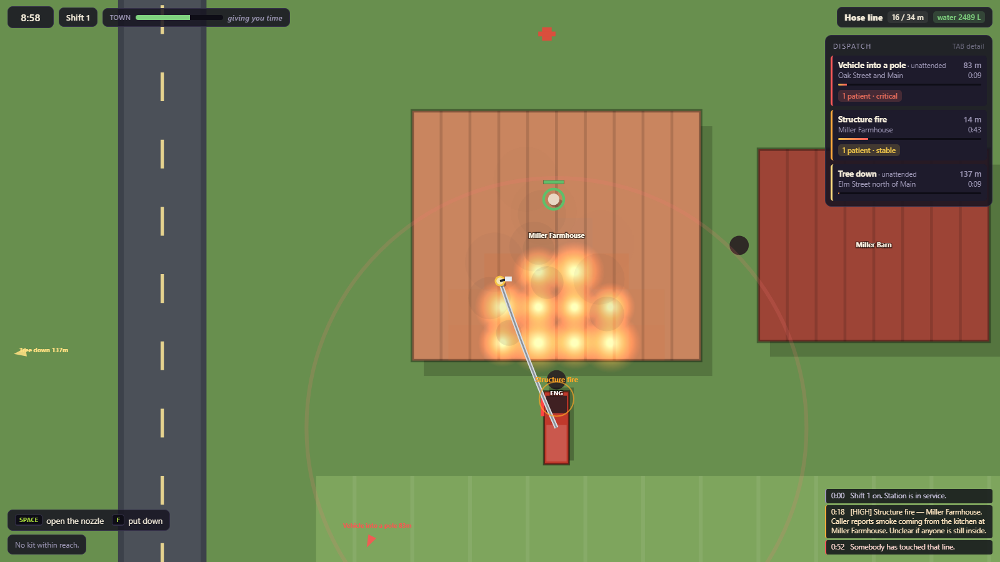
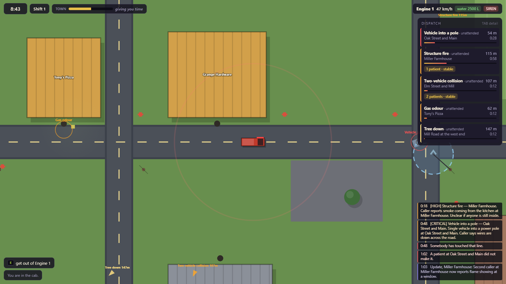
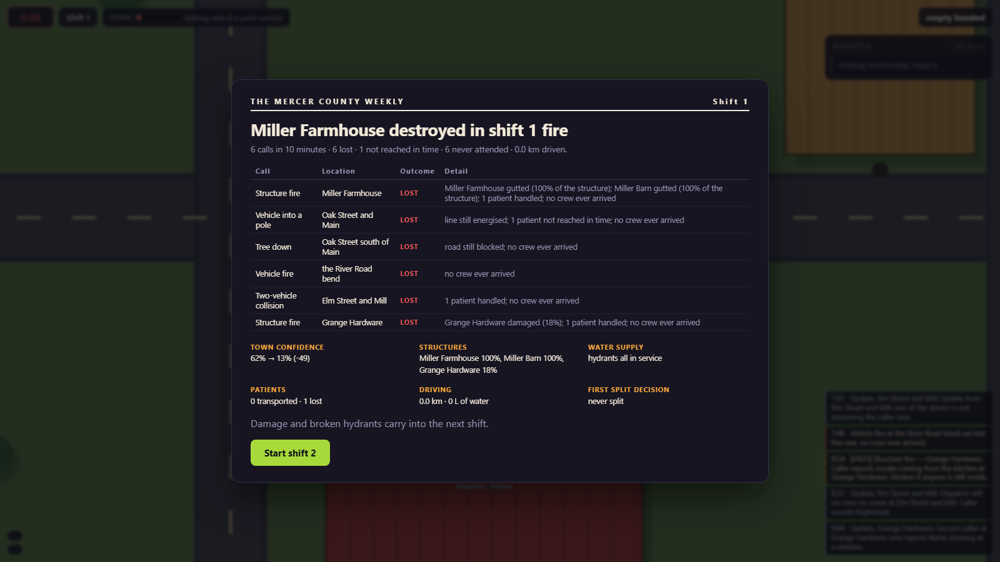

# Small Town Emergency Services

A cooperative-in-spirit (single-player for now) emergency-response sandbox in one
continuous top-down town. Browser, Canvas 2D, ES modules, zero dependencies, no build
step.

**▶ Play it: https://dumb-tony.github.io/SmallTownEmergencyServices/**

> **The town keeps going without you.**

Calls arrive incomplete and keep arriving. They age, deteriorate, combine and reroute
traffic whether or not anybody has driven to them. Nothing pauses when you open a panel,
nothing waits at the edge of a trigger volume, and losing a call does not end the shift —
it changes the town you turn up to next time.

See [GDD.md](GDD.md) for the design this is built against, and
[CHANGELOG.md](CHANGELOG.md) for what has actually been built.







## Running it

Play the published build at
**https://dumb-tony.github.io/SmallTownEmergencyServices/** — that is the link to send
anyone. Pages serves `main` at the repo root, so `git push` **is** the deploy: there is
no build step and no second repo.

To run it locally while working on it:

```bash
play.bat
```

That starts a local http server (ports 8381–8390) and opens a tab. **You cannot open
`index.html` from disk** — ES modules are blocked on `file://`.

## Controls

| Key | Does |
|---|---|
| `WASD` | walk · throttle, brake/reverse and steer in the cab |
| mouse | aim what you are holding (the keyboard aims by the way you are facing) |
| `E` | get in / get out · take hold of a patient · load them into the ambulance |
| `SPACE` | use whatever is in your hands, on whatever is in front of you |
| `1`–`5` | take a numbered item from the nearest compartment, the apron rack, or the ground |
| `F` | put down what you are holding |
| `Q` | siren |
| `TAB` | expand the call list · `ESC` pause · `F3` debug overlay |

Five verbs, as the GDD demands. Everything else is situation.

## What is in the town

Three apparatus, and they are not interchangeable:

- **Engine 1** — 2500 L, a 34 m hose line, hydrant wrench, extinguisher. Slow. **No medical kit.**
- **Medic 1** — the medical kit, and the only vehicle that can take anyone to the clinic. No rescue gear.
- **Rescue 1** — chainsaw, hydraulic spreaders, insulated hot stick, gas meter. No water.

Eleven named buildings, four through-routes each way, eleven hydrants, eight poles,
one clinic. Five incident families (fire, crash, tree, medical, utility) across eleven
templates.

Things that are *systems*, not scripts, and therefore chain into each other:

- fire spreads cell by cell through a structure and jumps to an exposure 9 m away;
- gas accumulates until an ignition source is close enough, then it does not accumulate any more;
- a downed line stays live until it is killed **at the pole** — and water on the ground makes its live zone bigger;
- a burning wreck next to a building is how a road call becomes a structure fire;
- a trunk across the lane genuinely blocks the lane, so the shortest route stops being the shortest route;
- flattening a hydrant with the engine puts it out of service — this shift and the next.

## Persistence

One shift is the unit of persistence. Between shifts the town keeps building damage,
boarded-up shops, broken hydrants, its confidence in you, and a headline. `stes.town.v1`
in `localStorage`, versioned, with a migration path and a default fallback.

## Architecture

```
src/config.js        every tunable number
src/core/            rng · clock · eventBus · input · persistence
src/data/            town.js (places) · incidents.js (call catalogue) · equipment.js
src/sim/             hazards · victims · incidentSim · dispatch · movement · interaction
src/render/          camera · renderer          (read state, never write it)
src/ui/              hud · shiftReport
src/game.js          the authoritative simulation and the only step order
src/main.js          bootstrap; the only mutable globals
```

`rng.js`, `clock.js`, `eventBus.js`, `input.js` and `camera.js` were copied from
`Dev\AirportBaggageCrew` per `Dev\INDEX.md` — same names kept so the lineage stays
greppable.

Simulation modules **return** event objects; `game.js` is the only thing that puts them
on the bus or lets them touch the town. Rendering and the HUD read state and decide
nothing.

## Tests

No Node on this machine, so the harness is a headless browser.

```bash
powershell -ExecutionPolicy Bypass -File tools\smoketest.ps1 -Tests tools\m0-tests.js
```

- `tools/m0-tests.js` — skeleton and design locks: RNG, clock, bus, controls, town
  geometry, persistence, loadouts, movement, live frames, determinism.
- `tools/m1-tests.js` — the systems: fire spread and suppression, water supply, gas
  ignition chains, live lines, blockage, patients, dispatch pacing, incident lifecycle,
  and the GDD's signature-scenario acceptance test.
- `tools/m2-tests.js` — playability. `tools/_crewbot.js` plays whole shifts through the
  real input path: same `moveAxis`, same `wasPressed` edges, same numbered slot list the
  HUD renders. It asserts the game's own thesis by running an idle control shift on the
  same seed — a crew that turns up must close more calls, lose fewer, and let less of
  the town burn than a crew that never leaves the station. It found nine bugs.

**259 assertions.**

Suites emit progressively, so a hang still reports how far it got.

## Known limitations

Deliberate MVP shortcuts, per the GDD's "deliberate simplifications":

- proximity-and-facing interactions rather than rigid-body tools;
- staged extrication and treatment rather than simulated procedure;
- single player — the host-authoritative split is designed for but not built;
- no smoke or fluid simulation; smoke is a visual read of burning cells.
